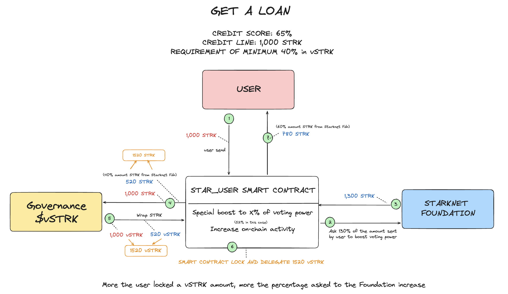

# Star User 

Under-collateralized lending protocol using verifiable credentials to give a credit score for opening dynamic credit lines and give more power to small and loyal users, then encourage decentralization and active participation on Starknet.

### Description

Star User is the Only Dust of users. This under-collateralized lending protocol leverages the on-chain reputation on Starknet to give a credit score, open a dynamic credit line to small and loyal users, allowing them to borrow $STRK, encourage decentralization and active participation in governance by wrapping $STRK, then improve activity on Starknet thanks to their continuous actions.

> This project has been built during ETHGlobal StarkHack. More information [here](https://ethglobal.com/events/starkhack).

- Try the application for yourself here 👉 [website](link/)
- Watch the demo video and project page here 👉 [video](https://ethglobal.com/showcase/star-user-p38xo)

We want to continue this project after the hackathon and work with the Starknet Foundation and open-source contributors from Only Dust.

### How does it work

The protocol targets the best Starknet users, with less than $10,000 in their wallets.

1 - Credit Scoring based on on-chain reputation

2 - Dynamic credit line based on your continuous actions

3 - Innovative Loan System to boost voting power and increase on-chain activity for small and loyal users

4 - Safeguarding System using game theory to create a virtuous community 

### Loan - Smart Contract Workflow 

This system has two objectives for the Starknet Foundation: give more voting power for the governance to their small and loyal users, and increase the on-chain activity on Starknet.

1️⃣ According to their credit score and credit line (X), the user sends **X $STRK** and defines how much he wants to put in vSTRK (minimum 40%)

2️⃣ According to the amount put in vSTRK, the smart contract asks a **Y percentage of X $STRK**, that is superior of the amount sent by the user (to boost the voting power)

3️⃣ The foundation sends **Y $STRK** to the smart-contract

4️⃣ & 5️⃣ The smart contract wraps in vSTRK the **X $STRK** from the user and the 40% minimum from the foundation to boost voting power

6️⃣ The smart contract locks and delegates **Z $vSTRK**

7️⃣ The remains **Y $STRK** from the foundation is sent to the user to increase on-chain activity

### Roadmap

- Notification system to prevent risk when a user is close to the deadline
- Finish and improve the credit score algorithm
- Sybil resistance: detect whales and bot activity to avoid a big amount split in different wallets
- “How to improve your credit score” with a quest system
- Create a community note to open a contest to exclude a user with bad behavior
- Implement Tokenbound Accounts
- A decentralized voting pool system for the governance
- Create an API for protocols to prevent systemic risk by sharing the user credit score with them
